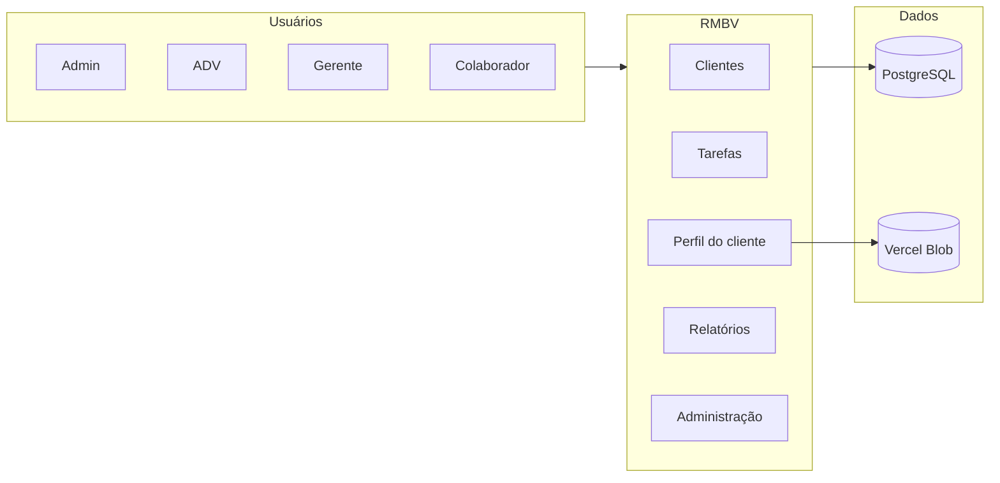

# RMBV System

Plataforma web para gestão de clientes jurídicos com equipes isoladas, teses (ações), Kanban de tarefas, histórico de comunicação, relatórios e controle de acesso por categoria.

**Produção:** [rmbv.vercel.app](https://rmbv.vercel.app) · **Health:** [/api/health](https://rmbv.vercel.app/api/health)

---

## Índice

- [Visão geral](#visão-geral)
- [Funcionalidades](#funcionalidades)
- [Papéis e permissões](#papéis-e-permissões)
- [Stack técnica](#stack-técnica)
- [Início rápido](#início-rápido)
- [Variáveis de ambiente](#variáveis-de-ambiente)
- [Scripts](#scripts)
- [Deploy](#deploy)
- [Estrutura do projeto](#estrutura-do-projeto)
- [Documentação](#documentação)

---

## Visão geral

O **RMBV System** centraliza o fluxo de localização e acompanhamento de clientes em escritórios com múltiplas equipes. Cada equipe opera de forma isolada — clientes, teses, tarefas e templates — enquanto o administrador tem visão global.

O cadastro segue o modelo `MODEL.csv` (COD, TESE, NOME, CPF, telefones, endereços, status). Não há dependência de IA paga: pesquisa e extração de dados usam regras locais sobre texto colado.



---

## Funcionalidades

### Clientes

| Recurso | Descrição |
|---------|-----------|
| Painel de clientes | Lista paginada, busca, filtros por status, workflow e tese |
| Perfil completo | Dados do `MODEL.csv`, documentos, pesquisa e revisão |
| Cadastro manual | Formulário com análise de texto (telefones/endereços sem IA) |
| Importação CSV | Admin importa em lote (`;`, modelo em `public/MODEL.csv`) |
| Finalização | Fluxo solicitar → aprovar, com sync automático no Kanban |
| Duplicatas por CPF | Bloqueio na **mesma tese**; aviso informativo em **outras teses** |

### Kanban e tarefas

| Recurso | Descrição |
|---------|-----------|
| Board por equipe | Colunas customizáveis (nome, cor, coluna final) |
| SLA / prazos | Alertas de atraso e “vence em breve” |
| Histórico da tarefa | Comentários e log de mudanças |
| Perfil do cliente | Aba Tarefas + criar tarefa com cliente pré-vinculado |
| Sync finalização | Solicitação → coluna Aguardando; aprovação → Concluído |

### Comunicação (histórico do cliente)

| Recurso | Descrição |
|---------|-----------|
| Registros | Ligação, WhatsApp e nota livre com texto digitado |
| Templates | Mensagens salvas por equipe, com botão “Usar” |
| Timeline | Status, verificação de telefone e comunicações unificados |

### Relatórios

| Recurso | Descrição |
|---------|-----------|
| Cards por status | Aguardando, Localizado, Sem sucesso, Tente novamente |
| Gráfico mensal | Novos clientes, finalizados e localizados (12 meses) |
| Metas | Finalizações por mês (equipe ou ADV) com % atingido |
| Exportação | Clientes e tarefas em CSV (Excel); relatório PDF |

### Administração

| Recurso | Descrição |
|---------|-----------|
| Equipes | Criar, renomear, ativar/desativar |
| Usuários | Criar ADV/Gerente/Colaborador; editar, desativar, trocar senha |
| Teses | Por equipe, com filtro global no header |
| Categorias + RBAC | Permissões de criar/ler/editar/excluir por categoria |

---

## Papéis e permissões

| Papel | Escopo |
|-------|--------|
| **ADMIN** | Todas as equipes, usuários, importação CSV, relatórios globais |
| **ADV** | Sua equipe; gerencia membros e teses; aprova finalização |
| **GERENTE** | Sua equipe; operação completa nos clientes liberados |
| **COLABORADOR** | Sua equipe; acesso conforme permissões de categoria |

Credenciais padrão após `npm run db:seed`:

| Papel | Login | Senha |
|-------|--------|--------|
| Admin | `Admin` ou `admin@sistema.local` | `rmbvadmin` |
| ADV | `adv@sistema.local` | `Adv@123` |
| Gerente | `gerente@sistema.local` | `Gerente@123` |

---

## Stack técnica

| Camada | Tecnologia |
|--------|------------|
| Framework | [Next.js 15](https://nextjs.org) (App Router, Turbopack em dev) |
| Linguagem | TypeScript |
| UI | React 19, Tailwind CSS v4, Lucide Icons |
| Banco | PostgreSQL via [Prisma](https://www.prisma.io) |
| Auth | JWT (cookie httpOnly) + bcrypt |
| Validação | Zod |
| PDF | PDFKit |
| Storage | Vercel Blob (documentos em produção) |
| Deploy | [Vercel](https://vercel.com) + [Neon](https://neon.tech) |

---

## Início rápido

### Pré-requisitos

- **Node.js 20+**
- **PostgreSQL** (Neon recomendado)
- Conta GitHub + Vercel (para deploy)

### Instalação local

```bash
git clone https://github.com/MaulXD/RMBV.git
cd RMBV
npm install
cp .env.example .env
```

Edite `.env` com `DATABASE_URL` e `JWT_SECRET` (mín. 32 caracteres).

```bash
npm run db:push
npm run db:seed
npm run dev
```

Abra [http://localhost:3000](http://localhost:3000) e entre com `Admin` / `rmbvadmin`.

### Desenvolvimento com banco da Vercel

```bash
npx vercel env pull .env.local --environment=production
npm run env:setup-local
npm run db:push
npm run dev
```

> Valores secretos do `vercel env pull` podem vir vazios — copie `DATABASE_URL` e `JWT_SECRET` manualmente no painel da Vercel.

---

## Variáveis de ambiente

| Variável | Obrigatório | Descrição |
|----------|:-----------:|-----------|
| `DATABASE_URL` | Sim | Connection string PostgreSQL (`?sslmode=require`) |
| `JWT_SECRET` | Sim | Chave aleatória com 32+ caracteres |
| `ADMIN_EMAIL` | Seed | Email do administrador |
| `ADMIN_PASSWORD` | Seed | Senha do admin |
| `ADMIN_NAME` | Seed | Nome de login exibido (ex.: `Admin`) |
| `ADV_*`, `GERENTE_*` | Seed | Usuários extras opcionais |
| `BLOB_READ_WRITE_TOKEN` | Produção | Upload persistente de documentos |

Veja [.env.example](./.env.example) e [DEPLOY.md](./DEPLOY.md).

---

## Scripts

| Comando | Função |
|---------|--------|
| `npm run dev` | Servidor de desenvolvimento (Turbopack) |
| `npm run build` | `prisma generate` + build de produção |
| `npm run start` | Servidor após build |
| `npm run lint` | ESLint |
| `npm run db:push` | Sincroniza schema Prisma → banco |
| `npm run db:seed` | Usuários, equipes, categorias e permissões |
| `npm run db:migrate` | Migrations Prisma (dev) |
| `npm run env:setup-local` | Ajusta `.env.local` após `vercel env pull` |

---

## Deploy

O repositório está configurado para deploy automático na Vercel a cada push em `main`.

O `vercel.json` executa no build:

```
prisma generate → prisma db push → db:seed → next build
```

### Checklist

1. Importar o repo **MaulXD/RMBV** na Vercel
2. Conectar **Neon** pelo Marketplace (preenche `DATABASE_URL`)
3. Definir `JWT_SECRET` e variáveis de seed
4. *(Opcional)* Criar **Vercel Blob** para documentos
5. Deploy e validar `GET /api/health` → `"ok": true`

```bash
npx vercel --prod
```

---

## Estrutura do projeto

```
├── prisma/
│   ├── schema.prisma      # Modelos: User, Team, Client, Task, Kanban…
│   └── seed.ts            # Dados iniciais
├── public/
│   └── MODEL.csv          # Modelo de importação
├── src/
│   ├── app/               # Rotas Next.js (pages + API)
│   │   ├── dashboard/     # Lista de clientes
│   │   ├── kanban/        # Board de tarefas
│   │   ├── clients/       # Perfil e cadastro
│   │   ├── reports/       # Relatórios e gráficos
│   │   ├── admin/         # Painel administrativo
│   │   └── api/           # REST API
│   ├── components/        # UI React
│   └── lib/               # Regras de negócio, auth, queries
├── docs/
│   └── PASSO-A-PASSO.md   # Guia completo de uso
├── design.md              # Identidade visual
├── DEPLOY.md              # Deploy detalhado
└── vercel.json
```

### Rotas principais

| Rota | Acesso | Descrição |
|------|--------|-----------|
| `/dashboard` | Autenticado | Painel de clientes |
| `/clients/new` | Autenticado | Novo cliente |
| `/clients/[id]` | Autenticado | Perfil do cliente |
| `/kanban` | Autenticado | Kanban de tarefas |
| `/reports` | Autenticado | Relatórios e exportação |
| `/admin` | ADMIN | Equipes, usuários, CSV |
| `/equipe` | ADV | Membros e teses da equipe |
| `/api/health` | Público | Diagnóstico do ambiente |

---

## Documentação

| Arquivo | Conteúdo |
|---------|----------|
| [docs/PASSO-A-PASSO.md](./docs/PASSO-A-PASSO.md) | Instalação, deploy, fluxo admin e troubleshooting |
| [DEPLOY.md](./DEPLOY.md) | Vercel, Neon, Blob e variáveis |
| [design.md](./design.md) | Paleta claro/escuro, tipografia e ícones |
| [docs/RELATORIO-AUDITORIA.md](./docs/RELATORIO-AUDITORIA.md) | Notas técnicas de auditoria |

---

## Licença

Projeto privado — uso interno. Todos os direitos reservados.
